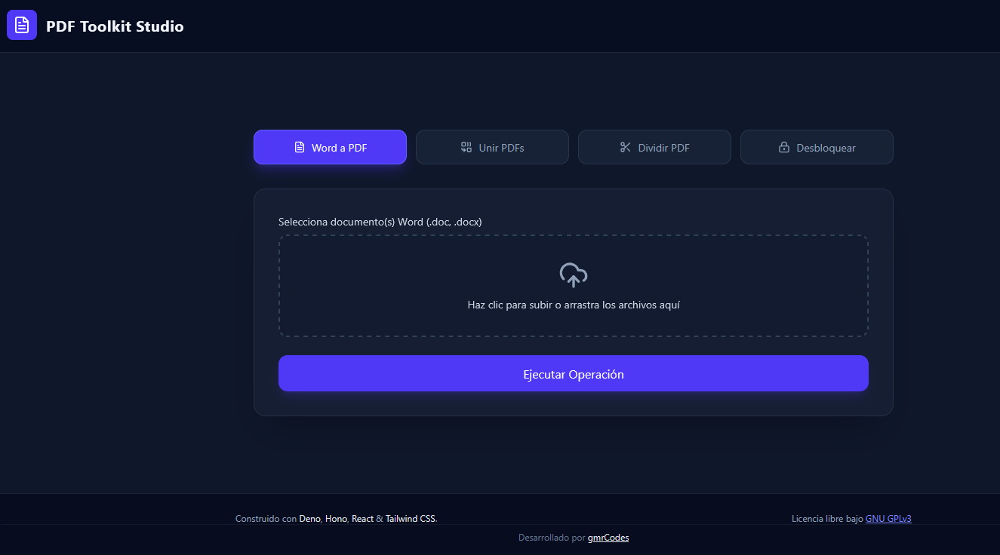

# PDF Toolkit API

Un motor local tipo SaaS para procesamiento y manipulación masiva de archivos
PDF, construido con **Deno**, **Hono**, **LibreOffice**, **QPDF** y un frontend
moderno en **React + Tailwind CSS**.

## 📸 Vista Previa



---

## 🚀 Características

- **Conversión de Word a PDF:** Conversión individual o por lotes de archivos
  `.doc` y `.docx` a PDF (generando un archivo `.zip` en lotes).
- **Combinar PDFs:** Unificación de múltiples documentos PDF en un solo archivo.
- **Dividir PDF:** Extracción de rangos específicos de páginas.
- **Desbloquear PDF:** Eliminación de contraseñas y restricciones de
  encriptación mediante QPDF.
- **Interfaz Web Intuitiva:** Dashboard interactivo en React con modo oscuro y
  descargas automáticas.

---

## 🛠️ Stack Tecnológico

### Lenguajes

- **TypeScript:** Lenguaje principal tanto en backend como frontend para
  garatizar un tipado estático y seguro.
- **HTML5 & CSS3:** Estructura y estilos de la aplicación web.

### Backend (API Engine)

- **Runtime:** [Deno](https://deno.com/) (Entorno de ejecución seguro para
  JavaScript y TypeScript).
- **Framework Web:** [Hono](https://hono.dev/) (Framework web ultrarrápido y
  ligero de estándares web).
- **Manipulación de PDF:** [`pdf-lib`](https://pdf-lib.js.org/) (Librería nativa
  para unir y dividir PDFs).
- **Empaquetado y Compresión:** [`jszip`](https://stuk.github.io/jszip/)
  (Generación de archivos `.zip` en memoria para conversiones por lote).

### Frontend (Dashboard Web)

- **Librería UI:** [React](https://react.dev/) (Construcción de interfaz basada
  en componentes).
- **Bundler / Build Tool:** [Vite](https://vitejs.dev/) (Entorno de desarrollo
  rápido y empaquetador para el cliente).
- **Estilos CSS:** [Tailwind CSS v4](https://tailwindcss.com/) (Framework
  utilitario de CSS) +
  [`@tailwindcss/postcss`](https://www.npmjs.com/package/@tailwindcss/postcss).
- **Iconografía:** [Lucide React](https://lucide.dev/) (Set de iconos
  vectoriales limpios y ligeros).

### Herramientas del Sistema / CLI

- **LibreOffice (Headless):** Motor en segundo plano utilizado para convertir
  documentos `.doc` / `.docx` a `.pdf`.
- **QPDF:** Herramienta CLI especializada en la transformación y desencriptación
  de archivos PDF.

---

## 🛠️ Requisitos Previos

Asegúrate de tener instaladas las siguientes herramientas en tu sistema:

1. **Deno** (v1.40+)
   [Descarga Deno](https://docs.deno.com/runtime/getting_started/installation/)
2. **Node.js** (v18+) [Descarga Node.js](https://nodejs.org/en/download)
3. **LibreOffice** (Asegurado en el PATH del sistema)
   [Descarga LibreOffice](https://www.libreoffice.org/download/)
4. **QPDF** (Asegurado en el PATH del sistema)
   [Descarga QPDF windows](https://sourceforge.net/projects/qpdf/)
   #### Ubuntu / Debian / Linux Mint / Pop!_OS:
   ```bash
   sudo apt install qpdf
   ```
   #### Fedora / RHEL / CentOS:
   ```bash
   sudo dnf install qpdf
   ```
   #### Arch Linux / Manjaro:
   ```bash
   sudo pacman -S qpdf
   ```

---

## ⚙️ Instalación y Ejecución

### I Modo desarrollo (Dev Mode)

#### 1. Clona el repositorio (Clone the repository)

Abre una terminal, clona el repositorio e ingresa a la carpeta

```bash
git clone https://github.com/gmrcodes/pdf-toolkit-api.git
cd pdf-toolkit-api
```

#### 2. Backend (API Engine)

Ejecuta Deno server en modo desarrollo

```bash
deno task dev
```

La API estará escuchando en http://localhost:8000

#### 3. Frontend (Dashboard Web)

En otra terminal, entra a la carpeta client y ejecuta el server:

```bash
cd client
npm install
npm run dev
```

La aplicación web estará disponible en http://localhost:5173

### II Modo Usuario (User Mode)

#### Uso Local (Local use)

- Descarga la versión pre-compilada del ejecutable para tu Sistema.
  [Descargar](https://github.com/gmrcodes/pdf-toolkit-api/releases/tag/v1.0.0)
- Descomprime dentro de la carpeta "/pdf-toolkit-api" clonada en el paso
  anterior
- Ejecuta PDF-Toolkit o PDF-Toolkit.exe
- Abre el navegador web e ingresa a http://localhost:8000

#### Uso en LAN (LAN use)

- Abre una terminal en el equipo servidor y busca la ip

#### En Windows:

```bash
ipconfig
```

#### En Linux/MacOS

```bash
hostname -I
```

- Ejecuta PDF-Toolkit o PDF-Toolkit.exe en el PC Servidor
- Abre el navegador web en el PC Cliente o movil en la misma red WiFi/LAN e
  ingresa a http://ip-del-servidor:8000 (ej. http://192.168.0.10:8000)

---

## 📡 Endpoints de la API

| Método |            Ruta             |        Descripción        |     Body (form-data)     |
| :----: | :-------------------------: | :-----------------------: | :----------------------: |
|  POST  | /api/v1/convert/word-to-pdf |   Convierte Word a PDF    |  files (File / File[])   |
|  POST  |      /api/v1/pdf/merge      |  Combina múltiples PDFs   |      files (File[])      |
|  POST  |      /api/v1/pdf/split      | Divide un PDF por páginas | file, startPage, endPage |
|  POST  |     /api/v1/pdf/unlock      |  Remueve clave de un PDF  |      file, password      |

---

## 🏗️ Estructura del Proyecto

```text
├── client/                   # Application Frontend (React + Vite + Tailwind CSS)
│   ├── src/
│   │   ├── App.tsx           # Dashboard UI con integración de endpoints
│   │   ├── index.css         # Importación de Tailwind CSS
│   │   └── main.tsx          # Punto de entrada de React
│   ├── tailwindcss.config.js # Configuración de theme e integración
│   ├── postcss.config.js     # Procesador de PostCSS para Tailwind
│   └── vite.config.ts        # Configuración de proxy para API
├── src/                      # Backend API Engine (Deno + Hono)
│   ├── controllers/          # Controladores de peticiones HTTP
│   ├── routes/               # Enrutadores Hono
│   ├── services/             # Lógica de conversión y manipulación
│   ├── utils/                # Ejecutor de comandos del sistema
│   └── main.ts               # Punto de entrada y middleware CORS
├── deno.json                 # Configuración de Deno e import maps
├── LICENSE
└── README.md
```

---

## 📄 Licencia

Este proyecto está bajo la Licencia GNU General Public License v3.0 (GPLv3).
Consulta el archivo [LICENSE](LICENSE) para obtener más detalles.
